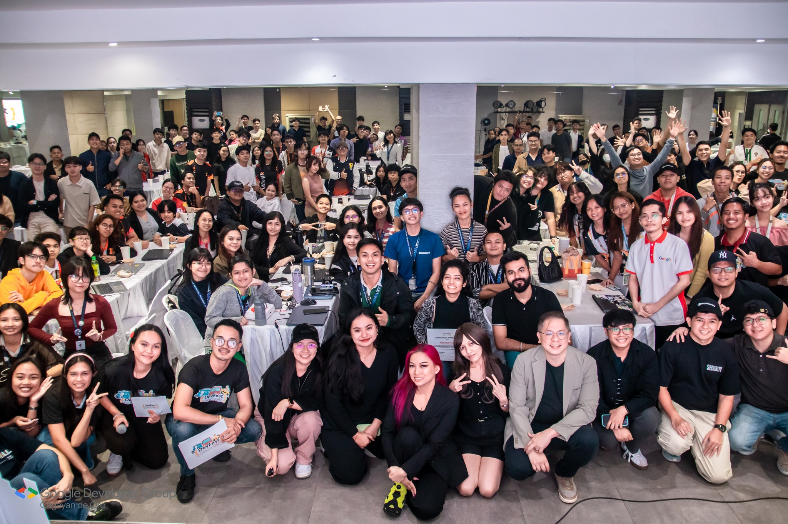
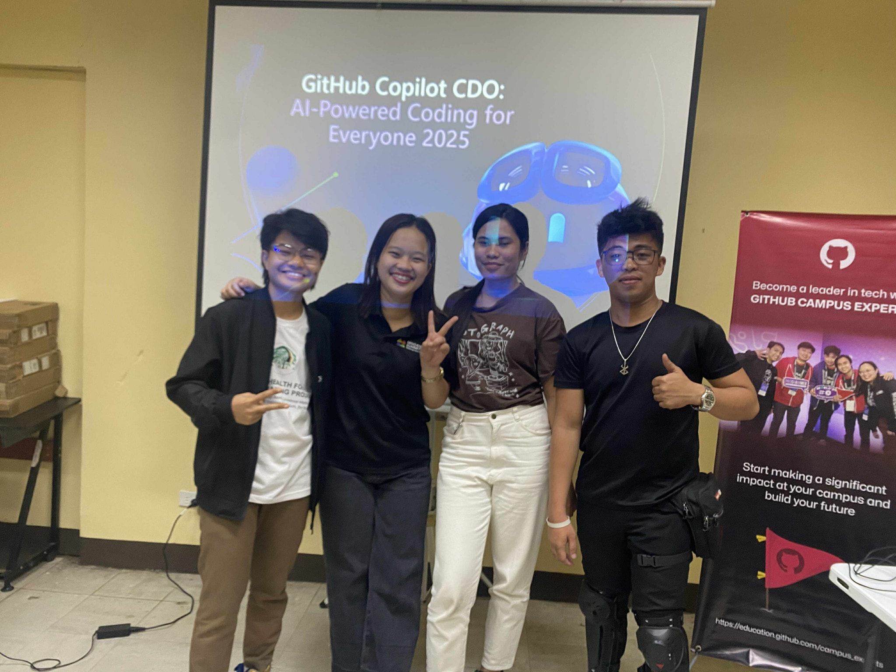

  <h1>Hi there, 👋 I'm Iren Salazar</h1>

  <!--Animated Typing SVG -->
  

   

  

    
  

   

  <!-- Centered Socials & Portfolio -->
  

    
    
    
    
    
  

   

  <!-- Centered Tech Stack Icons -->
  <h3>🛠️ Languages and Tools</h3>

  
 
     &nbsp;
     &nbsp;
     &nbsp;
     &nbsp;
     &nbsp;
     &nbsp;
     &nbsp;
     &nbsp;
     &nbsp;
     &nbsp;
     &nbsp;
     &nbsp;
     &nbsp;
     &nbsp;
     &nbsp;
     &nbsp;
     &nbsp;
     &nbsp;
     &nbsp;
     &nbsp;
     &nbsp;
    
  

 

 

### 👩‍💻 A Little About Me

- 🔭 I love working on **Javascript programming projects**
- 🌱 I’m currently learning **Project Management**
- 👯 I’m looking to collaborate on **Python Web Development**
- 🤝 I’m looking for help with **Building a StartUp!**
- 💬 Ask me about **Java Programming**
- 📫 Reach out to me: [**salazariren043@gmail.com**](mailto:salazariren043@gmail.com)
- ⚡ Fun fact: **I love singing, songwriting, and I'm addicted to Sports!** 🎤🏀

 
 

 

<!-- NBlancs Style: GitHub Stats & Activity Section -->

  <h3>📊 GitHub Analytics</h3>

  <!-- Activity Graph (Customized with your blue theme) -->
  
  
   
  
  

 

 

**📸 Event Gallery**

  
  
  

 

 

<!-- Centered Footer / Support Section -->

  <h3>☕ Support My Work</h3>
  

    
    
  

