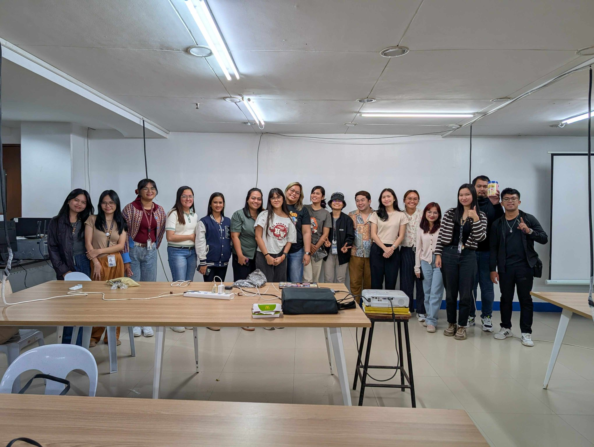

<div align="center">

<!-- Profile View Counter -->


<br/><br/>

<!-- Name & Animated Title -->
<h1>
  
</h1>

<p><em>Designing interfaces people love. Building things that actually work.</em></p>

<br/>

<!-- Social Badges -->
<a href="https://sites.google.com/view/iren-salazar/home" target="_blank">
  
</a>&nbsp;
<a href="https://www.linkedin.com/in/iren-salazar-209857281/" target="_blank">
  
</a>&nbsp;
<a href="https://www.facebook.com/StartsAtZero" target="_blank">
  
</a>&nbsp;
<a href="https://www.instagram.com/_x_uraqtdr_x_/" target="_blank">
  
</a>&nbsp;
<a href="https://www.youtube.com/@iren-salazar" target="_blank">
  
</a>

</div>

---

## `$ whoami`

```yaml
name:       Iren Salazar
location:   Cagayan de Oro, Philippines 🇵🇭
roles:      [ UI/UX Designer, Web Developer, IT Support Specialist ]
building:   A startup 🚀
learning:   Project Management
seeking:    Python Web Dev collaborators
passions:   [ JavaScript, Java, Singing, Songwriting, Sports ]
contact:    salazariren043@gmail.com
```

<br/>

<table>
  <tr>
    <td width="55%">
      
    </td>
    <td width="45%" align="center">
      
    </td>
  </tr>
</table>

---

## 🛠️ Tech Stack

<div align="center">

**Frontend**


**Backend & Languages**


**Cloud & DevOps**


**Design**


**IoT**


</div>

---

## 🎤 Workshops & Community Events

> *Driving tech literacy forward — one event at a time.*

| 📅 Date | 🎪 Event | 🎭 Role | 🔍 Focus |
|:--------|:---------|:--------|:---------|
| **Jul 2025** | University SINATECH Pitching | 🛠️ Team Lead | Frontend Dev & UX Design |
| **Aug 2025** | Django Girls CDO 2025 | 🗣️ Active Participant | Back-End Development |
| **Mar 2025** | DevFest 2025 | 🤝 Participant | AI Chatbot & PC Building |
| **Mar 2025** | Copilot CDO: AI-Powered Coding | 💡 Technical Lead | LLMs in IT Workflows |

---

## 📸 Event Gallery

<p align="center">
  
  
  
  
</p>

---

## 📊 GitHub Activity

<div align="center">
  
</div>

---

<div align="center">

### ☕ Support My Work

<a href="https://www.buymeacoffee.com/irenie" target="_blank">
  
</a>&nbsp;&nbsp;
<a href="https://ko-fi.com/irenie" target="_blank">
  
</a>

<br/><br/>

*"Building cool things, one commit at a time."* 

</div>
